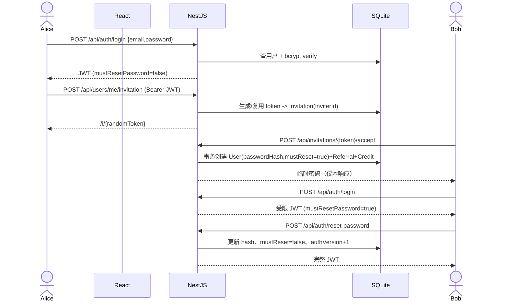
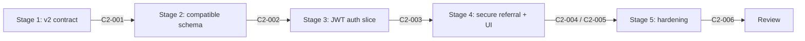

# Referral Demo 认证、安全短邀请链接与 UI 升级实施蓝图

> 文档状态：Implementation Blueprint v2.1，Stage 1–5 已实现并通过验收
> 基线：保留 `2026-08-20-implementation-blueprint.md` 已实现的 React + NestJS + SQLite + Docker Compose 架构与推荐奖励事务
> 新增范围：简洁高级 UI、邮箱密码登录、JWT、随机临时密码、首次登录强制改密、数据校验、统一异常、随机短 token 邀请链接

## 1. Executive framing

- **Demo goal：** 在既有邀请返利闭环上补齐真实的用户身份边界。邀请人登录后才能查看自己的余额、记录并生成链接；新用户通过不泄露邀请人标识的短 token 注册，获得一次性展示的随机临时密码，首次登录必须改密。
- **Primary users and highest-value flow：** Alice 用邮箱/密码登录 → 查看自己的 Dashboard → 生成 `/i/{opaqueToken}` 链接 → Bob 注册并获得临时密码 → Bob 首次登录被强制改密 → 改密后进入自己的 Dashboard；Alice 的奖励仍精确增加一次。
- **In scope：** 邮箱密码、JWT Bearer 认证、受限首次登录 JWT、密码哈希、认证后 `me` API、随机临时密码、12 位不透明短 token、前后端校验、稳定错误码、简洁高级且响应式 UI、迁移/测试/Compose/README。
- **Deferred：** 邮件发送密码、忘记密码、Refresh Token、多设备会话撤销、OAuth、RBAC、验证码、邀请过期/轮换、短域名服务、生产密钥托管、限流/WAF、Redis/MQ。
- **Assumptions：** 账号即规范化小写邮箱；所有用户角色相同；Alice 的演示密码由 `DEMO_INVITER_PASSWORD` 注入；新用户临时密码只在注册成功响应/UI 中出现一次且不写日志；JWT 有效期默认 30 分钟；改密后 `authVersion + 1` 使旧 token 失效；token 使用去除易混字符的 12 位随机串，约 60 bit 熵。
- **Open questions：** 生产环境如何把临时密码交付给用户尚未指定，不阻塞 Demo，使用“一次性页面展示”；忘记密码和邀请 token 失效策略不阻塞本阶段，明确延期。

## 2. Proposed architecture

选型顺序：现有仓库约定 → 用户新增约束 → 原蓝图的单仓库/少服务默认 → 最小新增依赖。认证使原 Harness 中“禁止认证”的旧约束失效，必须同步更新为“禁止 Passport/Redis/外部 IdP，允许本地 JWT 最小边界”。

| Area | Choice | Responsibility | Rationale and selection evidence |
| --- | --- | --- | --- |
| Frontend | 现有 React 19 + Router + Query + RHF/Zod | 登录、强制改密、受保护 Dashboard、公开邀请注册 | 沿用仓库，无新增前端状态库；认证状态集中在 AuthProvider |
| Backend | 现有 NestJS + `@nestjs/jwt` + `bcryptjs` | 登录、JWT 签发/校验、密码哈希、授权守卫 | Nest 原生 JWT 模块足够；bcryptjs 避免新增原生构建风险；不引入 Passport 的额外抽象 |
| Data | 现有 SQLite + TypeORM migration | `passwordHash`、`mustResetPassword`、`authVersion`、`Invitation.token` | 保留单服务 Demo；所有 schema 变化通过第二个 migration，`synchronize:false` 不变 |
| Runtime | 现有 web/api 两容器 | Nginx 同源代理，环境变量注入 JWT 和 seed 密码 | 无第三个服务；Compose 仍一条命令启动 |
| External services | 无 | 临时密码仅一次性展示 | 邮件服务不在需求中，避免凭证阻塞演示 |

### Request flow

### Contracts and runtime

- `POST /api/auth/login`：`{email,password}`；成功 `200 {accessToken,user:{id,name,email,mustResetPassword}}`；凭据错误统一 `401 INVALID_CREDENTIALS`，不区分邮箱是否存在。
- `GET /api/auth/me`：Bearer JWT；成功返回当前用户；缺失/无效/过期/旧版本 token 返回 `401`；强制改密 token 可调用。
- `POST /api/auth/reset-password`：Bearer JWT；`{currentPassword,newPassword,confirmPassword}`；校验当前密码、两次一致、新旧不同与强度；成功增加 `authVersion` 并返回新完整 JWT。
- `GET /api/users/me/referral-summary`、`POST /api/users/me/invitation`：必须是完整 JWT；受限 token 返回 `403 PASSWORD_RESET_REQUIRED`。
- `GET /api/invitations/:token`、`POST /api/invitations/:token/accept`：公开；token 必须严格匹配 12 位允许字符；注册响应新增 `temporaryPassword`，仅一次展示。
- **User：** 新增 `passwordHash varchar(255) nullable`（兼容旧数据）、`mustResetPassword boolean default true`、`authVersion integer default 0`；密码从不进入 DTO、日志和普通查询响应。
- **Invitation：** `token varchar(12) unique` 是随机服务端引用，唯一关联 `inviterId`；URL 不携带用户业务标识。
- **JWT claims：** `{sub,email,mustResetPassword,authVersion}`；服务端每次鉴权回查用户并比对版本/状态，不能仅信任 claim。
- **Validation：** 全局 whitelist/forbidNonWhitelisted；邮箱规范化；密码 10–72 字符且至少含字母和数字；token、UUID 风格主键、请求体和配置均有边界校验。
- **Error envelope：** `{statusCode,code,message,requestId,timestamp,path,details?}`；生产 5xx 不泄露堆栈/SQL；字段错误可用受限 `details`；认证日志不记录密码、JWT 或完整邮箱。
- **Startup：** `docker compose up --build -d`；本地 `pnpm dev`；健康检查 `/api/health`。
- **Required env：** `JWT_SECRET`（生产必须非默认且长度至少 32）、`JWT_EXPIRES_IN=30m`、`DEMO_INVITER_PASSWORD`；`.env.example` 只给 Demo 占位值。
- **Demo data：** Alice 幂等 seed，密码来自环境；已有 Alice 会补齐/更新凭据而不重置余额；旧的无凭据邀请用户无法登录，clean-start Demo 不受影响。
- **Non-goals：** 不做 Refresh Token、Cookie/CSRF、邮件、生产短域、密码找回、令牌黑名单或横向扩容。

## 3. Dependency map

### 3.1 Contract register

| Contract ID | Produced by | Consumed by | Contract/artifact | Status | Compatibility rule |
| --- | --- | --- | --- | --- | --- |
| C2-001 | Stage 1 | Stage 2–5 | 本文需求、API、错误、威胁边界 | frozen v2 | 改密码交付或 JWT 策略需先改契约 |
| C2-002 | Stage 2 | Stage 3–5 | migration v2、User/Invitation schema | additive+migration | 不修改 v1 奖励表及事务不变量 |
| C2-003 | Stage 3 | Stage 4–5 | Auth API、Guard、JWT claims | v1 | 强制改密 JWT 只能访问 me/reset |
| C2-004 | Stage 4 | Stage 5 | `/i/:token` 与一次性临时密码流程 | v1 | token 永不编码/返回 inviter 标识 |
| C2-005 | Stage 4 | Stage 5 | AuthProvider、受保护路由、UI 状态模型 | v1 | 权威权限仍由 API 执行 |
| C2-006 | Stage 5 | Reviewer | clean-start、测试、构建、日志与截图证据 | verified target | 所有证据从干净专用卷产生 |

### 3.2 Stage dependency graph

## 4. Staged delivery plan

### Stage 1 — v2 安全与体验契约已冻结

- **Result：** 新增五项需求全部映射到接口、数据、错误与验收规则，旧蓝图被保留。
- **Scope：** 本文、Harness 约束变更清单、兼容/延期说明。
- **Non-goals：** 不改产品代码。
- **Prerequisites / Consumes：** v1 已验证蓝图与当前仓库；无新增契约。
- **Provides：** C2-001 给 Stage 2–5。
- **Frontend / Backend / Data boundary：** 仅定义，不实现。
- **Acceptance criteria：** 文件使用新时间戳且旧文件未覆盖；可检索 JWT、首次改密、随机短 token、异常契约和 UI 规则；安全停止时产品行为未改变。
- **Validation evidence：** `rg -n "C2-001|mustResetPassword|randomToken|INVALID_CREDENTIALS" .agents/plans/2026-08-20-112115-implementation-blueprint.md`。
- **Risks / rollback：** 仅文档，可直接修订；无外部副作用。
- **Approval gate：** 用户已明确授权先计划后实现，none。
- **Coding-agent handoff：** “冻结 v2 契约，不覆盖旧蓝图；确认 Demo 临时密码一次展示与 Alice 环境密码默认值，然后进入 Stage 2。”

### Stage 2 — 认证与短 token 数据基础可兼容迁移

- **Result：** 新 schema 可从 v1 SQLite 自动迁移，Alice 有可验证密码，新注册用户可持久化哈希与首次改密状态。
- **Scope：** TypeORM entity/migration、配置校验、seed、依赖和 Harness 约束更新。
- **Non-goals：** 不开放登录页面或改变奖励规则。
- **Prerequisites / Consumes：** C2-001。
- **Provides：** C2-002 给 Stage 3–5。
- **Frontend boundary：** none。
- **Backend boundary：** 密码哈希 helper/config；seed 不输出密码。
- **Data/runtime boundary：** 第二 migration 将 `code` 改为 `token` 并增用户认证列；不触碰奖励事实数据。
- **Acceptance criteria：** v1 DB migration 后四张原表数据仍在；clean DB Alice 可用 env 密码；`passwordHash` 永不出现在响应/日志；`synchronize:false` 保持；迁移可 down。
- **Validation evidence：** API migration/seed 测试、`pnpm --filter api test`、架构脚本。
- **Risks / rollback：** SQLite rename/column default 差异；用真实临时 DB 测试，失败时迁移事务回滚。
- **Approval gate：** none。
- **Coding-agent handoff：** “只实现 C2-002；以 migration 演进 schema，添加 bcryptjs/JWT 依赖和配置校验，更新旧 Harness 的认证禁令；运行数据库集成测试。”

### Stage 3 — JWT 登录与首次强制改密形成后端保护切片

- **Result：** Alice 可登录；错误凭据被统一拒绝；受限 JWT 只能查看自身和改密；改密后旧 token 失效，新 token 可访问本人 Dashboard API。
- **Scope：** AuthModule、DTO、Guard/decorator、me/login/reset、`users/me` 和 `users/me/invitation`。
- **Non-goals：** 不做 refresh、忘记密码、角色权限。
- **Prerequisites / Consumes：** C2-001、C2-002。
- **Provides：** C2-003 给 Stage 4–5。
- **Frontend boundary：** 仅 API 类型，可用集成测试验证。
- **Backend boundary：** Controller 处理 HTTP，AuthService 处理身份，Guard 负责强制改密/版本检查；禁止信任前端 userId。
- **Data/runtime boundary：** 每次认证回查 User；改密事务更新 hash/flag/version。
- **Acceptance criteria：** 合法登录 200；未知邮箱和错误密码都为 `401 INVALID_CREDENTIALS`；无 Bearer 访问 summary 为 401；受限 token 为 403；正确改密返回完整 token且旧 token 401；弱密码/不一致为 400；日志无密码/JWT/完整邮箱；安全停止时公开注册仍可工作。
- **Validation evidence：** Auth service/controller 集成测试和 Swagger 契约。
- **Risks / rollback：** 误保护公开邀请 API；测试明确公开/受保护路由矩阵，AuthModule 可单独回退。
- **Approval gate：** none。
- **Coding-agent handoff：** “实现 C2-003 最小 JWT 边界；所有本人资源从 JWT sub 推导；覆盖 401/403/改密版本失效，禁止记录秘密。”

### Stage 4 — 安全短邀请注册与高级简洁 UI 已端到端接通

- **Result：** UI 从登录到 Dashboard、短链接注册、临时密码、首次改密可完整演示，API 不再通过 URL/userId 暴露邀请关系。
- **Scope：** 12 位 token 生成与 `/i/:token`；注册时生成临时密码及 hash；AuthProvider/ProtectedRoute；Login/Reset/Dashboard/Invitation 页面；整体视觉系统。
- **Non-goals：** 不做动画框架、主题系统、邮件。
- **Prerequisites / Consumes：** C2-001–C2-003。
- **Provides：** C2-004/C2-005 给 Stage 5。
- **Frontend boundary：** sessionStorage 保存 JWT；API client 自动 Bearer；401 清会话；页面使用米白底、深墨色、克制铜金强调、细边框/柔和阴影、明确排版层级；移动端 320px 无横向滚动；表单逐字段错误与全局错误并存。
- **Backend boundary：** token 格式严格校验；注册事务新增随机密码哈希但不改变 referral/credit exactly-once；临时密码仅成功 DTO 返回。
- **Data/runtime boundary：** DB 仅存 hash；token unique + 限次冲突重试。
- **Acceptance criteria：** 链接严格为 `/i/{12位token}`，无法从 token 推断用户；公开查询只返回邀请人姓名；注册响应一次返回临时密码且 DB/日志无明文；Bob 首次登录自动导航改密，未改密不能进 Dashboard；改密后可以；Alice 只能看到自己的摘要；前端所有请求失败有可恢复提示；web 单测覆盖登录、route guard、临时密码、错误映射；320/1440 视口可用；安全停止时业务数据原子性仍由原事务保证。
- **Validation evidence：** API/web focused tests、真实浏览器截图、日志敏感信息搜索。
- **Risks / rollback：** 临时密码被刷新丢失是刻意的安全行为，UI 明确要求立即保存；短链接旧路径不兼容，README 明确 v2 clean-start。
- **Approval gate：** none。
- **Coding-agent handoff：** “实现 C2-004/C2-005；保持 referral transaction；UI 克制、响应式、可访问；覆盖每个 loading/error/empty/success 状态，不增加范围。”

### Stage 5 — 校验、异常、Harness 与 clean-start 证据全部通过

- **Result：** 代码、OpenAPI、README、Harness 与运行行为一致，干净专用卷可一键完成 v2 旅程。
- **Scope：** 补齐异常 details、OpenAPI、验证脚本、README、lint/test/build、Compose smoke、日志隐私、最终 diff。
- **Non-goals：** 不借加固加入生产基础设施。
- **Prerequisites / Consumes：** C2-001–C2-005。
- **Provides：** C2-006 给 Reviewer。
- **Frontend boundary：** a11y label/focus、禁用重复提交、生产构建。
- **Backend boundary：** 4xx 稳定 code；5xx 安全消息；Guard、DTO、配置与 token 边界测试。
- **Data/runtime boundary：** 仅对明确的 `referral-demo-data` 专用卷 clean-start；普通 restart 持久化。
- **Acceptance criteria：** `pnpm verify` exit 0；Compose 两容器 healthy；Alice 登录→生成链接→Bob 注册→临时密码登录→强制改密→Dashboard→Alice 100 Credit；重启后数据保留；API logs 搜索不到密码、JWT、完整邮箱；Swagger 与实现一致；旧 Harness 禁令已替换为新的认证安全约束；安全停止时 README 足以由新评审者复现。
- **Validation evidence：** 命令输出、HTTP smoke、截图、Compose logs、final diff。
- **Risks / rollback：** `down -v` 不可恢复，只允许既有安全 reset 脚本验证目标后执行；失败保留容器诊断。
- **Approval gate：** 删除非专用数据前必须确认；本项目专用 reset 脚本已具目标校验。
- **Coding-agent handoff：** “只做 v2 hardening 和验收；任何业务缺陷回到所属 Stage 修正；提交命令、行为、日志和契约证据。”

## 5. Final demo acceptance journey

1. 配置 Demo 环境并运行 `docker compose up --build -d`，确认 `/api/health` 正常。
2. 打开 `/login`，用 `alice@example.com` 和 Demo 密码登录，进入自己的 Dashboard。
3. 生成邀请链接，确认 URL 是 `/i/{12位随机token}` 且页面不显示用户 ID/邮箱作为链接参数。
4. 无痕窗口打开链接，用 Bob 邮箱注册；复制只显示一次的随机临时密码。
5. 登录 Bob，确认自动进入强制改密页，直接访问 `/` 也不能绕过。
6. 输入当前临时密码与符合强度的新密码，改密成功后进入 Bob Dashboard。
7. 回到 Alice，刷新后余额增加 100 且只有一条 Bob 记录；重复 Bob 注册不再奖励。
8. 重启 Compose，Alice/Bob 新密码和奖励持久化；旧受限 token 已失效。
9. 执行 `pnpm verify` 和运行 smoke，检查日志无密码/JWT/完整邮箱。

## 6. Handoff order

- [x] Stage 1：保存 C2-001，新蓝图不覆盖 v1。
- [x] Stage 2：消费 C2-001，产出 schema C2-002；v1 数据卷迁移和旧邀请码轮换已验证。
- [x] Stage 3：消费 C2-002，产出认证 C2-003；401/403/改密后旧 token 失效已验证。
- [x] Stage 4：消费 C2-003，产出短 token/UI C2-004/C2-005；桌面与 390px 浏览器检查已通过。
- [x] Stage 5：消费全部契约，产出 C2-006；`pnpm verify`、Compose 和运行旅程已通过。

每阶段结束都报告：变更文件与行为、通过/失败验收、命令证据、假设/风险/阻塞、契约变化及下游影响、推荐下一阶段。后续阶段不得把未验证契约当作事实。
