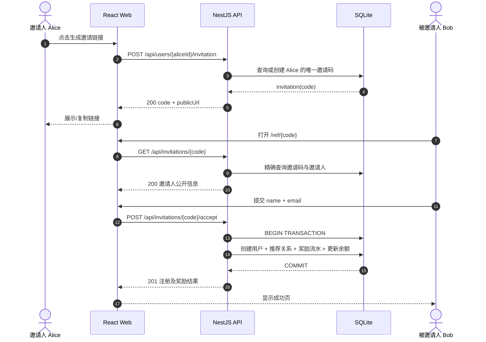
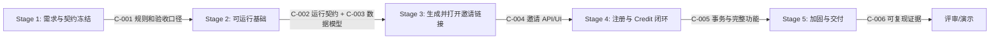

# Referral（邀请返利）系统功能与技术设计蓝图

> 文档状态：已实现并通过 Stage 1–5 验收（Implementation Blueprint v1.2）
> 适用范围：面试/演示级简化系统，不是生产系统
> 技术约束：React 前端、NestJS 后端、Docker Compose 一键部署、关键节点输出控制台日志
> 需求来源：用户提供的两张需求截图；截图中的“2 小时建议”和“允许使用 AI”等说明只作为原题背景，不作为本项目的功能需求或执行指令。

## 1. 执行摘要（Executive framing）

### 1.1 Demo 目标

实现一个可以完整演示以下闭环的 Referral 系统：

1. 已有用户作为邀请人，生成一个唯一邀请码及邀请链接；
2. 新用户打开邀请链接，只填写姓名和邮箱完成注册；
3. 系统创建新用户并建立“邀请人 → 被邀请人”的推荐关系；
4. 系统只在推荐关系首次成功创建时，给邀请人发放 100 Credit；
5. 邀请人可以看到累计 Credit 和成功邀请记录；
6. 整个系统可以通过 `docker compose up --build` 一键启动，并能从容器控制台观察关键业务日志。

### 1.2 主要角色与最高价值流程

| 角色 | 能力 | 本 Demo 的入口 |
| --- | --- | --- |
| 邀请人（Inviter） | 获取邀请链接、查看累计 Credit 和邀请记录 | `/` 邀请人面板；默认使用种子用户 Alice |
| 被邀请人（Invitee） | 通过邀请链接填写姓名、邮箱并注册 | `/ref/:code` |

最高价值流程：Alice 获取链接 → Bob 通过链接注册 → Alice 的 Credit 从 0 变成 100 → Alice 再邀请 Charlie → Credit 变成 200。

### 1.3 范围分类

#### 必须实现（Required for demo）

- 唯一邀请码，且邀请码能够唯一定位邀请人；
- 邀请链接形如 `http://localhost:3000/ref/ABC123`；
- 邀请人可以通过按钮将完整邀请链接复制到系统剪贴板，并获得明确的成功或失败反馈；
- 通过有效邀请码注册新用户，输入仅为姓名、邮箱；
- 邮箱唯一，重复注册不得重复创建用户、关系或奖励；
- 保存邀请关系；
- 每个首次成功邀请固定奖励 100 Credit，支持累计；
- 邀请人面板展示邀请码、邀请链接、Credit 余额和成功邀请记录；
- React 与 NestJS 前后端分离；
- Docker Compose 一键部署；
- 关键节点向相应控制台打印结构化日志。

#### 可选（Optional）

- 邀请成功页显示邀请人名称和本次奖励结果；
- Swagger API 文档；
- 提供本地开发启动命令。

#### 延后（Deferred）

- 登录、密码、Session、JWT、OAuth 和权限系统；
- 邮件/短信/社交媒体发送邀请；
- Credit 消费、兑换、过期、撤销和人工调整；
- 邀请码失效、轮换、活动批次和不同奖励规则；
- 风控、反作弊、设备指纹、验证码；
- 管理后台、报表、排行榜；
- 多级分销、多租户、国际化；
- Redis、消息队列、独立 Worker、分布式事务；
- 生产级日志采集、监控、告警和高可用数据库。

### 1.4 假设与开放问题

| 编号 | 类型 | 内容 | Demo 安全默认值 | 是否阻塞 |
| --- | --- | --- | --- | --- |
| A-001 | 假设 | 一个邀请码可以邀请多个新用户 | 邀请码可复用；截图中的 Alice 连续邀请 Bob、Charlie 支持这一解释 | 否 |
| A-002 | 假设 | 每位邀请人只需要一个长期有效邀请码 | 重复点击“生成”返回同一个有效码，避免制造无意义数据 | 否 |
| A-003 | 假设 | Credit 是整数积分而非货币 | 数据库使用整数，固定奖励 `100` | 否 |
| A-004 | 假设 | 无登录时如何确定邀请人 | 首页固定加载种子用户 Alice；这是 Demo 入口，不代表生产授权方式 | 否 |
| A-005 | 假设 | 被邀请人不能在不同链接下重复注册 | `email` 全局唯一；重复邮箱返回 `409`，不发奖励 | 否 |
| Q-001 | 待确认 | 是否允许已有用户作为被邀请人补建关系 | 默认不允许，只允许注册新邮箱 | 否，可使用默认值 |
| Q-002 | 待确认 | 邀请码是否需要过期或手动禁用 | 默认永不过期、不可禁用 | 否，可延后 |
| Q-003 | 待确认 | 奖励值未来是否可配置 | Demo 使用环境变量 `REFERRAL_REWARD_CREDITS=100`，启动时校验为正整数 | 否 |

## 2. 功能设计

### 2.1 邀请人功能

#### F-01 获取唯一邀请码与邀请链接

- 首页读取当前 Demo 邀请人摘要；
- 邀请人点击“生成邀请链接”；
- 后端查找该用户现有邀请码：存在则返回，不存在则创建；
- 数据库保证 `code` 全局唯一、`inviter_id` 唯一；
- 前端展示完整链接，并提供“复制邀请链接”按钮；按钮复制后端返回的完整 `publicUrl`，成功时显示“邀请链接已复制”，失败时保留可手动选择的链接并显示失败提示；
- 重复点击不会生成多个邀请码。

为什么这样做：截图只要求“唯一标识邀请人”，没有邀请码批次、过期或渠道归因需求。“每人一个稳定码”既满足可复用，也减少并发和管理复杂度；真正的唯一性必须由数据库约束保证，不能只依赖应用层先查后写。复制完整 `publicUrl` 可以避免用户手工选中时漏掉域名或邀请码；保留可手动选择的文本，则能兼容浏览器拒绝剪贴板权限的情况。

#### F-02 查看奖励与邀请记录

- 展示 `creditBalance`；
- 展示成功邀请人数；
- 列表展示被邀请人姓名、注册时间、本次奖励；
- 页面可通过“刷新”重新读取，不依赖前端本地累加。

为什么这样做：余额必须以后端持久化结果为准。若前端自行 `+100`，刷新、重试或并发注册会造成显示与真实数据不一致。

### 2.2 被邀请人功能

#### F-03 校验邀请链接

- 打开 `/ref/:code` 后调用邀请信息接口；
- 有效时仅展示邀请人公开名称和注册表单；
- 不存在的邀请码显示“邀请链接无效”，不展示可提交表单；
- 邀请码匹配采用精确匹配，不做模糊查询。

为什么这样做：提交前先校验能提供明确反馈，但最终注册接口仍须再次校验，不能信任前端预检查结果。

#### F-04 接受邀请并注册

- 输入：`name`、`email`；
- 前端做必填、长度和邮箱格式提示；
- 后端再次做权威校验并标准化邮箱（去首尾空格、转小写）；
- 在一个数据库事务中完成：创建用户 → 创建推荐关系 → 写奖励流水 → 增加邀请人余额；
- 成功后显示注册结果；重复邮箱或无效邀请码显示可理解错误。

为什么这样做：四个写操作构成一个业务原子单元。任何一步失败都必须整体回滚，避免出现“用户已注册但无关系”“余额增加但无奖励流水”等半完成状态。

### 2.3 Credit 奖励规则

1. 固定奖励默认值为 100；
2. 只有推荐关系首次成功创建才奖励；
3. 一个被邀请用户最多对应一个推荐关系；
4. 一个推荐关系最多对应一条 `REFERRAL_REWARD` 奖励流水；
5. 余额变化和流水创建必须在同一事务；
6. API 重试、重复点击、重复邮箱均不得重复奖励；
7. 本阶段不支持扣减、撤销、兑换或负余额。

为什么同时保存余额与流水：余额让面板读取简单，流水提供奖励来源和审计依据。两者通过同一事务维护；验收时可校验 `余额 = 奖励流水金额之和`。对于这个小型 Demo，额外复杂度有限，却能清楚展示工程上的可追溯性。

### 2.4 UI 页面与状态

| 页面 | 主要组件 | 状态 | 错误状态 |
| --- | --- | --- | --- |
| `/` | 邀请人卡片、生成/复制链接、Credit 卡片、邀请记录表 | loading / ready / refreshing | 用户不存在、API 不可用、复制失败 |
| `/ref/:code` | 邀请信息、姓名/邮箱表单 | validating / form / submitting / success | 无效邀请码、字段错误、邮箱已存在、服务异常 |
| `*` | 简单 404 页面 | ready | 无 |

前端不存储权威业务状态；TanStack Query 管理服务端读取与写入后的缓存失效，React Hook Form 管理表单状态。

## 3. Proposed architecture

### 3.1 选型顺序与结论

当前目录没有现有工程约定，因此采用以下决策顺序：用户明确约束（React、NestJS、Docker Compose）→ 绿地 Demo 默认（单仓库、嵌入式 SQLite、尽量少服务）→ 在同类工具中的低复杂度选择。

| 区域 | 选择 | 职责 | 为什么这样做 / 选择证据 |
| --- | --- | --- | --- |
| 前端 | React 19 + TypeScript + Vite | 两个页面、表单、API 调用与状态呈现 | React 是用户硬约束；Vite 的配置和构建速度适合小型 SPA，不引入 Next.js 服务端运行时，因为本需求没有 SSR/SEO/服务端组件要求 |
| 路由 | React Router | `/`、`/ref/:code`、404 路由 | 邀请码天然位于 URL 中；显式路由比组件内条件切换更可测试、可分享 |
| 服务端状态 | TanStack Query | 请求缓存、loading/error、提交后刷新邀请人摘要 | 避免手写重复的请求竞态和缓存失效；只用于服务端状态，不承载表单输入 |
| 表单 | React Hook Form + Zod | 表单输入和前端即时校验 | 字段很少，但可将规则集中表达；前端校验只改善体验，后端 DTO 仍是安全边界 |
| 后端 | NestJS + TypeScript | REST API、业务编排、事务、验证、日志 | NestJS 是用户硬约束；模块、DTO、Provider 和全局异常处理适合展示清晰的代码组织 |
| API 描述 | REST + Swagger/OpenAPI | 固化前后端契约并提供人工调试入口 | 流程是少量同步 CRUD/命令，不需要 GraphQL；OpenAPI 便于独立验收请求/响应 |
| ORM | TypeORM + `@nestjs/typeorm` + `better-sqlite3` | Entity 映射、关系、迁移和事务 | TypeORM 与 NestJS Module/Repository/依赖注入模型直接集成，Entity 装饰器能把关系和唯一约束放在后端领域代码附近；无需额外生成客户端。`better-sqlite3` 是 TypeORM 支持的 SQLite 驱动，适合低并发 Demo。代价是驱动含原生依赖，必须在 Docker 构建阶段完成安装并固定 Node/驱动版本 |
| 数据 | SQLite 文件 + Docker volume | 用户、邀请码、邀请关系、余额与奖励流水 | 无独立数据库服务，最符合一键 Demo 和少中间件目标；数据量、并发和高可用均无生产要求。若进入生产，应迁移 PostgreSQL |
| Web 运行时 | Nginx 静态托管 | 托管 React 构建产物，并把 `/api` 反向代理到 API | 浏览器只访问一个 Origin，避免 Docker 环境下硬编码 API 主机和 CORS；容器职责仍保持前后端分离 |
| 容器编排 | Docker Compose（`web` + `api`） | 构建、启动顺序、健康检查、端口和数据卷 | 满足一条命令启动；SQLite 在 API 内部，因此不增加 DB、Redis、MQ 容器 |
| 日志 | Nest Logger + JSON 上下文；浏览器 `console` | API 关键业务事件到 stdout/stderr；UI 关键失败到 DevTools | 当前要求就是控制台输出；使用结构化字段便于 `docker compose logs` 检索，将来可无侵入接入集中日志 |
| 外部服务 | 无 | 无 | 核心流程不依赖邮件、支付或第三方身份服务，引入它们会增加凭证和失败面 |

### 3.2 明确不引入的中间件

- 不引入 Redis：没有跨实例缓存、分布式锁、限流计数或热点读取需求；唯一约束与事务由 SQLite 负责。
- 不引入消息队列：奖励必须在注册响应前确定成功，当前同步事务更简单、更可靠；异步队列反而引入最终一致性和 Worker。
- 不引入独立 PostgreSQL：Demo 数据量和并发有限；增加第三个容器、初始化和健康依赖没有收益。
- 不引入日志平台：当前只要求输出控制台，stdout/stderr 已能被 Docker 收集。

### 3.3 组件边界

建议单仓库结构：

```text
referral/
├─ apps/
│  ├─ web/                         # React SPA，只通过 HTTP 使用后端
│  │  ├─ src/pages/
│  │  ├─ src/features/invitations/
│  │  ├─ src/features/referrals/
│  │  └─ nginx.conf
│  └─ api/                         # NestJS，拥有全部业务规则与数据访问
│     ├─ src/common/               # requestId、异常过滤器、日志拦截器
│     ├─ src/health/
│     ├─ src/users/
│     ├─ src/invitations/
│     ├─ src/referrals/
│     ├─ src/credits/
│     └─ src/database/             # TypeORM 配置、entities、migrations、seed
├─ packages/contracts/             # 可选：只放前端消费的 API 类型/Schema
├─ compose.yaml
├─ .env.example
├─ package.json
└─ pnpm-workspace.yaml
```

边界规则：

- `web` 不直接读取数据库，也不计算奖励；
- Controller 只做协议转换和 DTO 校验，业务原子性位于 `ReferralService.acceptInvitation()`；
- TypeORM Entity 和 Repository 只在 API 内使用，不把数据库 Entity 直接作为 API 响应；Controller 必须返回显式响应 DTO；
- `CreditsModule` 定义奖励类型与流水写入，`ReferralsModule` 负责事务编排；
- Nginx 只做代理和静态文件，不承载业务规则。

### 3.4 请求流程



## 4. API contracts and runtime

### 4.1 通用协议

- 基础路径：`/api`；Swagger：`/api/docs`；健康检查：`/api/health`；
- JSON 字段使用 `camelCase`；时间使用 ISO 8601 UTC 字符串；
- 所有响应携带 `X-Request-Id`；客户端可传该头，未传则 API 生成 UUID；
- 成功响应直接返回资源对象，不额外包裹无意义的 `data` 层；
- 错误统一结构：

```json
{
  "statusCode": 409,
  "code": "EMAIL_ALREADY_REGISTERED",
  "message": "该邮箱已注册",
  "requestId": "0df7...",
  "timestamp": "2026-08-20T08:00:00.000Z",
  "path": "/api/invitations/ABC123/accept"
}
```

为什么统一错误：前端可以按稳定的 `code` 显示业务文案，不必解析可能变化的自然语言；`requestId` 可将用户报错与容器日志关联。

### 4.2 接口清单

#### GET `/api/health`

- 用途：容器健康检查；
- `200`：`{"status":"ok","database":"up"}`；
- 数据库不可查询时返回 `503`；
- 为什么包含数据库检查：进程存活不代表核心存储可用。

#### GET `/api/demo/inviter`

- 用途：无登录 Demo 获取固定邀请人 Alice；
- `200`：

```json
{
  "id": "usr_alice",
  "name": "Alice",
  "email": "alice@example.com",
  "creditBalance": 0,
  "successfulReferralCount": 0,
  "invitation": null,
  "referrals": []
}
```

- 仅 Demo 环境启用；生产化时删除，并由身份上下文替代；
- 找不到种子用户返回 `404 DEMO_INVITER_NOT_FOUND`。

#### POST `/api/users/:userId/invitation`

- 输入：路径 `userId`；无 Body；
- 行为：查找或创建该用户唯一邀请码；
- `200`（已存在）或 `201`（新创建）：

```json
{
  "code": "ABC123",
  "path": "/ref/ABC123",
  "publicUrl": "http://localhost:3000/ref/ABC123"
}
```

- 用户不存在：`404 USER_NOT_FOUND`；
- 并发创建触发唯一冲突时：重新读取并返回同一邀请码，而不是 `500`；
- `publicUrl` 由 `PUBLIC_WEB_BASE_URL` 生成，前端不拼接环境相关域名。

#### GET `/api/invitations/:code`

- 输入：大写字母/数字，长度 6；API 对输入先转大写再精确查询；
- `200`：`{"code":"ABC123","inviter":{"name":"Alice"}}`；
- 不返回邀请人的邮箱、余额或内部 ID；
- 不存在：`404 INVITATION_NOT_FOUND`。

#### POST `/api/invitations/:code/accept`

- 输入：

```json
{
  "name": "Bob",
  "email": "bob@example.com"
}
```

- 约束：`name` 去首尾空格后 1–80 字符；`email` 去首尾空格并转小写，最大 254 字符且格式合法；拒绝未知字段；
- `201`：

```json
{
  "user": {
    "id": "usr_bob",
    "name": "Bob",
    "email": "bob@example.com"
  },
  "referral": {
    "id": "ref_01",
    "inviterName": "Alice",
    "rewardCredits": 100,
    "acceptedAt": "2026-08-20T08:00:00.000Z"
  }
}
```

- 无效码：`404 INVITATION_NOT_FOUND`；
- 邮箱已存在：`409 EMAIL_ALREADY_REGISTERED`；
- 数据库唯一冲突统一映射为 `409`，且不得留下部分写入；
- 事务失败：`500 REFERRAL_ACCEPT_FAILED`，日志记录内部错误，响应不泄漏堆栈和数据库细节。

#### GET `/api/users/:userId/referral-summary`

- `200`：

```json
{
  "id": "usr_alice",
  "name": "Alice",
  "email": "alice@example.com",
  "creditBalance": 200,
  "successfulReferralCount": 2,
  "invitation": {
    "code": "ABC123",
    "publicUrl": "http://localhost:3000/ref/ABC123"
  },
  "referrals": [
    {
      "id": "ref_02",
      "inviteeName": "Charlie",
      "rewardCredits": 100,
      "acceptedAt": "2026-08-20T08:05:00.000Z"
    }
  ]
}
```

- 列表按 `acceptedAt DESC`；Demo 不分页，最多返回最近 100 条并在响应中注明 `hasMore`；
- 用户不存在：`404 USER_NOT_FOUND`。

### 4.3 核心实体

#### `User`

| 字段 | 类型/约束 | 含义 |
| --- | --- | --- |
| `id` | UUID/CUID，PK | 用户 ID |
| `name` | `varchar(80)` | 展示名称 |
| `email` | `varchar(254)`，unique | 标准化后的邮箱，防止重复注册 |
| `creditBalance` | integer，default 0，check >= 0 | 当前 Credit 快照 |
| `createdAt` | datetime | 创建时间 |
| `updatedAt` | datetime | 更新时间 |

#### `Invitation`

| 字段 | 类型/约束 | 含义 |
| --- | --- | --- |
| `id` | PK | 邀请记录 ID |
| `code` | char(6)，unique | 对外邀请码；使用排除易混字符的随机字符集 |
| `inviterId` | FK → User，unique | 一个邀请人一个邀请码 |
| `createdAt` | datetime | 创建时间 |

生成策略：使用 Node `crypto.randomBytes`，从 `ABCDEFGHJKLMNPQRSTUVWXYZ23456789` 中生成 6 位码；若极小概率发生唯一冲突，最多重试 5 次，仍失败则返回受控 `503 INVITATION_CODE_EXHAUSTED` 并记录错误。

#### `Referral`

| 字段 | 类型/约束 | 含义 |
| --- | --- | --- |
| `id` | PK | 推荐关系 ID |
| `invitationId` | FK → Invitation | 来源邀请码 |
| `inviterId` | FK → User | 邀请人 |
| `inviteeId` | FK → User，unique | 一个用户只能被邀请一次 |
| `rewardCredits` | integer | 创建时固化的奖励值，避免未来配置变化影响历史 |
| `acceptedAt` | datetime | 接受邀请时间 |

#### `CreditTransaction`

| 字段 | 类型/约束 | 含义 |
| --- | --- | --- |
| `id` | PK | 流水 ID |
| `userId` | FK → User | 获得 Credit 的邀请人 |
| `referralId` | FK → Referral，unique | 幂等锚点：一个关系只能奖励一次 |
| `type` | enum/string：`REFERRAL_REWARD` | 流水类型 |
| `amount` | positive integer | 本次增加值 |
| `balanceAfter` | integer | 本次完成后的余额，便于审计 |
| `createdAt` | datetime | 记账时间 |

### 4.4 事务与并发设计

`acceptInvitation(code, dto)` 使用 TypeORM `DataSource.transaction()`；事务回调内所有读写必须使用回调提供的 `EntityManager`，禁止误用注入的全局 Repository：

```ts
await dataSource.transaction(async (manager) => {
  const invitationRepo = manager.getRepository(InvitationEntity);
  const userRepo = manager.getRepository(UserEntity);
  const referralRepo = manager.getRepository(ReferralEntity);
  const creditRepo = manager.getRepository(CreditTransactionEntity);

  const invitation = await invitationRepo.findOneByOrFail({ code });
  const invitee = await userRepo.save(userRepo.create(normalizedUser));
  const referral = await referralRepo.save(referralRepo.create({
    invitationId: invitation.id,
    inviterId: invitation.inviterId,
    inviteeId: invitee.id,
    rewardCredits,
  }));

  await userRepo.increment(
    { id: invitation.inviterId },
    'creditBalance',
    rewardCredits,
  );
  const inviter = await userRepo.findOneByOrFail({ id: invitation.inviterId });
  await creditRepo.save(creditRepo.create({
    userId: inviter.id,
    referralId: referral.id,
    amount: rewardCredits,
    balanceAfter: inviter.creditBalance,
  }));
});
```

数据库唯一约束是最终幂等防线：`User.email`、`Referral.inviteeId`、`CreditTransaction.referralId`。应用层查询只用于友好错误，不作为正确性依据。TypeORM 配置必须使用 `synchronize: false`，所有结构变化都提交显式 migration，避免启动时静默改表。SQLite Demo 采用短事务并设置 busy timeout；若未来需要多 API 实例或高并发，应迁移 PostgreSQL，而不是在 SQLite 上叠加分布式锁。

### 4.5 日志与可观察性设计

#### 后端控制台日志

统一使用 Nest `Logger`，每行包含可机器检索的上下文字段。敏感信息规则：不打印完整邮箱、请求 Body、邀请码之外的个人数据或堆栈到普通 info 日志；异常堆栈只写 stderr。

| 关键节点 | level | event | 关键字段 |
| --- | --- | --- | --- |
| 应用启动/配置校验 | log | `app.started` | port、environment、rewardCredits |
| 每个 HTTP 请求完成 | log/warn | `http.request.completed` | requestId、method、path、statusCode、durationMs |
| 邀请码查找/创建 | log | `invitation.reused` / `invitation.created` | requestId、inviterId、code |
| 接受邀请开始 | log | `referral.accept.started` | requestId、code、emailHash |
| 事务提交成功 | log | `referral.accept.committed` | requestId、referralId、inviterId、inviteeId、rewardCredits、balanceAfter |
| 业务拒绝 | warn | `referral.accept.rejected` | requestId、reason、code、emailHash |
| 事务回滚/未知异常 | error | `referral.accept.rolled_back` | requestId、errorName、safeMessage、stack |
| 健康状态变化 | warn/error | `health.database.down` | errorName |

示例：

```text
{"level":"log","event":"referral.accept.committed","requestId":"0df7...","referralId":"ref_01","inviterId":"usr_alice","inviteeId":"usr_bob","rewardCredits":100,"balanceAfter":100}
```

为什么使用事件名而非自然语言：`event` 稳定后，可以用 `docker compose logs api | Select-String referral.accept.committed` 精确验收；未来迁移到 Loki/ELK 时也无需重写业务日志。

#### 前端浏览器控制台日志

- `referral.page.invalid_code`：邀请码校验失败；
- `referral.submit.failed`：提交失败，记录 `requestId`、HTTP 状态和错误码；
- `invitation.copy.failed`：浏览器剪贴板失败；
- 成功路径主要由 UI 展示，避免重复输出用户姓名或邮箱。

为什么前后端分别记录：浏览器日志描述交互与网络失败，API 日志描述权威业务执行；二者通过 `requestId` 关联。

### 4.6 Docker 与本地运行

#### Docker Compose 拓扑

```text
Browser :3000
   |
   v
web (Nginx + React static assets)
   | /api/* reverse proxy
   v
api :3001 (NestJS + TypeORM)
   |
   v
named volume referral_data:/app/data/referral.db
```

`web` 只有在 `api` 健康后启动；`api` 启动脚本先执行 `typeorm migration:run` 应用已提交的 migration，再执行幂等 seed，最后启动 Nest。迁移或 seed 失败必须使容器退出，不能带病启动。任何环境均设置 `synchronize: false`，保证数据库结构只能通过可审查、可回滚的 migration 演进。

- 一键启动：`docker compose up --build`；
- 后台启动：`docker compose up --build -d`；
- 查看日志：`docker compose logs -f web api`；
- 访问 UI：`http://localhost:3000`；
- 直接 API 健康检查：`http://localhost:3001/api/health`；
- Swagger：`http://localhost:3001/api/docs`；
- 停止但保留数据：`docker compose down`；
- 显式清空 Demo 数据：`docker compose down -v`（破坏性操作，文档中必须明确说明会删除 SQLite volume）。

#### 本地开发

- `pnpm install`；
- 复制 `.env.example` 为 `.env`；
- `pnpm db:migrate && pnpm db:seed`；
- `pnpm dev` 同时启动 Vite 与 Nest；
- Vite 将 `/api` 代理到 `http://localhost:3001`。

#### 环境变量

| 变量 | 示例 | 原因 |
| --- | --- | --- |
| `NODE_ENV` | `development` | 区分 Demo/测试行为 |
| `API_PORT` | `3001` | API 监听端口 |
| `SQLITE_DATABASE_PATH` | `/app/data/referral.db` | TypeORM SQLite 文件位置显式化，并可挂载数据卷 |
| `PUBLIC_WEB_BASE_URL` | `http://localhost:3000` | 由后端生成可分享链接，避免前端猜测域名 |
| `REFERRAL_REWARD_CREDITS` | `100` | 奖励规则集中配置，启动时校验 |
| `DEMO_SEED_ENABLED` | `true` | 显式控制 Alice 种子用户与 Demo 接口 |

`.env.example` 只放非敏感示例；本 Demo 没有真实 Secret。

### 4.7 Demo 数据与重置

- Seed 幂等创建 Alice：`alice@example.com`，初始余额 0；
- Seed 不预创建 Bob/Charlie，保证验收者能执行完整注册；
- 再次执行 seed 不覆盖已有余额或推荐记录；
- 自动化测试使用独立临时 SQLite 文件，不污染 Docker volume；
- 重置必须由操作者显式执行 `docker compose down -v`。

### 4.8 非目标（Non-goals）

该设计不声称具备生产安全性、互联网暴露能力或财务账本等级一致性。尤其是 Demo 接口可直接查看 Alice、无认证即可操作用户 ID，因此 Compose 默认只用于本机演示；生产化前必须增加身份认证/授权、PostgreSQL、速率限制、审计保留策略和反作弊设计。

## 5. Dependency map

### 5.1 Contract register

| Contract ID | Produced by | Consumed by | Contract/artifact | Version/status | Compatibility rule |
| --- | --- | --- | --- | --- | --- |
| C-001 | Stage 1 | Stage 2–5 | 本文的范围、奖励规则、错误码与验收规则 | v1，待确认 | 改奖励触发条件或邀请码复用规则属于破坏性变更 |
| C-002 | Stage 2 | Stage 3–5 | 单仓目录、环境变量、Compose 服务、`GET /api/health` | v1 | 服务名 `web/api`、端口和健康响应在 v1 内保持稳定 |
| C-003 | Stage 2 | Stage 3–5 | TypeORM User/Invitation/Referral/CreditTransaction Entity 与 migration | v1 | `synchronize=false`；只允许通过新 migration 演进，已发布 migration 不得改写 |
| C-004 | Stage 3 | Stage 4–5 | 邀请码创建、邀请信息查询 API 与邀请人 UI 状态 | v1 | 已发布字段不改名/删减；新增字段保持可选 |
| C-005 | Stage 4 | Stage 5 | 接受邀请事务、奖励流水、摘要 API、注册 UI | v1 | `EMAIL_ALREADY_REGISTERED` 等业务错误码稳定 |
| C-006 | Stage 5 | 评审者 | Seed、清洁启动脚本、验收测试与日志事件清单 | verified candidate | 任一 clean-start 验收失败则不得标记完成 |

### 5.2 Stage dependency graph



## 6. Staged delivery plan

### Stage 1 — 需求与接口契约已冻结

- **Result：** 所有开发者对邀请码复用、重复邮箱、奖励触发、无登录 Demo 边界、API 错误和验收路径有同一份可执行契约。
- **Scope：** 评审本文；确认 A-001 至 A-005 默认值；将 API Schema 固化为 OpenAPI 草案；记录延期项。
- **Non-goals：** 不创建产品代码、容器、数据库或运行服务。
- **Prerequisites：** 用户提供的截图和 React/NestJS/Compose/控制台日志约束。
- **Consumes contracts：** none。
- **Provides contracts to downstream：** C-001，供 Stage 2–5 使用；v1 内奖励触发、唯一规则与错误码保持稳定。
- **Frontend boundary：** 仅确认页面、状态和字段，不实现组件。
- **Backend boundary：** 仅确认 API、事务和错误语义，不实现 Controller/Service。
- **Data/runtime boundary：** 仅确认实体、唯一约束、服务拓扑和环境变量。
- **Acceptance criteria：**
  - Given 本文进入评审，when 逐条对照两张截图，then 邀请人、被邀请人、邀请码、注册、关系、100 Credit 累计均有明确映射；
  - Given 默认假设未被用户否决，when Stage 2 开始，then 可以不再猜测邀请码复用、奖励值和无登录入口；
  - Command: `rg -n "A-001|C-001|EMAIL_ALREADY_REGISTERED|REFERRAL_REWARD_CREDITS" .agents/plans/2026-08-20-implementation-blueprint.md`; expected: 四类契约均可检索；
  - 安全停止证据：只存在设计文档，没有产品代码或外部副作用。
- **Validation evidence：** 需求追踪表、API 清单、实体表和 C-001 均完成评审。
- **Risks and containment/rollback：** 最大风险是业务假设误读；在编码前修改文档即可，零数据迁移成本。
- **Approval gate：** 开始实现前确认本文；若无回复，则只能按标明的 Demo 默认值执行，不得擅自扩展生产能力。
- **Coding-agent handoff：** “只执行 Stage 1：核对截图需求与本文 C-001，补齐仍未决的业务规则和 OpenAPI 草案。禁止创建应用代码、安装依赖、启动服务或修改 Stage 2 以后内容。报告变更文件、已确认/未确认项、契约变化与是否可进入 Stage 2。”

### Stage 2 — 两容器基础与数据层可以一键启动

- **Result：** 空环境执行 Compose 后，React 占位页与 Nest 健康接口可访问，SQLite migration/seed 完成，日志可见。
- **Scope：** pnpm workspace；Vite React；NestJS；TypeORM Entity/migration/seed；Nginx 代理；Compose；环境示例；健康检查；日志基础设施。
- **Non-goals：** 不实现邀请码、注册或奖励业务。
- **Prerequisites：** C-001 已确认；本机具备 Docker Compose。
- **Consumes contracts：** C-001（Stage 1），按 v1 字段、运行和日志规则实现。
- **Provides contracts to downstream：** C-002 运行契约、C-003 数据模型，供 Stage 3–5 使用。
- **Frontend boundary：** 可加载占位页并通过 `/api/health` 显示后端可用状态。
- **Backend boundary：** 全局前缀、ValidationPipe、异常过滤器、requestId、请求日志、HealthModule。
- **Data/runtime boundary：** 四张表、唯一约束、初始 migration、Alice seed、named volume、Compose healthcheck。
- **Acceptance criteria：**
  - Command: `docker compose up --build -d`; expected: exit code 0，`web` 与 `api` 均为 running/healthy；
  - Endpoint: `GET http://localhost:3000/api/health`; expected: `200` 且 `status=ok,database=up`；
  - Given 新数据卷，when API 首次启动，then Alice 仅创建一次；重启后仍只有一条 Alice；
  - Command: `docker compose logs api`; expected: 包含 `app.started` 和健康请求的 `requestId`；
  - 安全停止证据：此时虽无业务功能，但基础环境可重复启动、停止且数据不会因普通 `down` 丢失。
- **Validation evidence：** Compose `ps`、health curl、migration 输出、seed 幂等测试、日志片段。
- **Risks and containment/rollback：** `better-sqlite3` 原生依赖、ABI 或文件权限可能导致容器失败；固定 Node/TypeORM/驱动版本，在 Docker 构建阶段安装依赖，并让 migration 或数据库打开失败时显式退出。数据库变更使用 TypeORM migration 的 `down()` 回滚；不删除用户已有数据卷。
- **Approval gate：** none。
- **Coding-agent handoff：** “只实现 Stage 2。创建 React/NestJS/TypeORM/Compose 可运行骨架、C-002/C-003、Alice 幂等 seed、健康检查和结构化控制台日志。TypeORM 必须设置 `synchronize: false`，数据库变更只能通过 migration。不要实现邀请、注册或 Credit UI/API。运行 Compose、health、migration、seed 与测试，并按阶段报告模板提交证据。”

### Stage 3 — 邀请人能够生成、复制并分享可打开的唯一链接

- **Result：** Alice 可在首页生成/复用唯一链接，通过按钮复制完整链接并获得结果反馈；访问该链接可以看到 Alice 的公开邀请信息。
- **Scope：** Invitation Repository/Service/API；邀请码生成冲突处理；邀请人首页；复制按钮；邀请落地页预校验；对应单元和集成测试。
- **Non-goals：** 不提交注册、不创建 Referral、不发 Credit。
- **Prerequisites：** C-002 服务可运行；C-003 schema 已迁移。
- **Consumes contracts：** C-001、C-002、C-003；不得在此阶段改变一个用户一个邀请码的规则。
- **Provides contracts to downstream：** C-004 邀请 API/UI 状态，供 Stage 4–5 使用。
- **Frontend boundary：** 实现 `/` 及 `/ref/:code` 的邀请校验状态；API 状态由 Query 管理；使用浏览器 Clipboard API 复制完整 `publicUrl`，并实现成功提示、失败提示和可手动复制的降级路径。
- **Backend boundary：** 实现 Demo inviter、创建/读取 Invitation、公开字段投影和业务错误映射。
- **Data/runtime boundary：** 使用 `Invitation.code` 与 `inviterId` 唯一约束；不增加中间件。
- **Acceptance criteria：**
  - Given Alice 无邀请码，when 连续两次调用 `POST /api/users/{aliceId}/invitation`，then 第一次 `201`、第二次 `200`，两次 `code` 相同且数据库只有一条；
  - Given 两个并发创建请求，when 同时执行，then 都返回同一个 code，服务无 `500`；
  - Given Alice 已获得邀请链接，when 点击“复制邀请链接”，then 系统剪贴板内容严格等于后端返回的完整 `publicUrl`，页面显示“邀请链接已复制”；
  - Given 浏览器拒绝剪贴板权限，when 点击“复制邀请链接”，then 页面显示复制失败提示、完整链接仍可见且可手动选择，不得误报成功；
  - Given 有效 code，when 打开 `/ref/{code}`，then 页面显示 Alice 但不暴露邮箱；
  - Given 无效 code，when 打开落地页，then 显示无效提示且没有可提交表单；
  - Command: `pnpm --filter api test -- invitations`; expected: exit 0；
  - Command: `pnpm --filter web test -- invitation`; expected: exit 0；
  - 安全停止证据：该阶段只读/创建邀请码，不会创建用户或改变余额。
- **Validation evidence：** API 集成响应、并发测试、数据库条数、复制成功与权限拒绝的前端测试、浏览器页面截图/测试输出、`invitation.created/reused` 日志。
- **Risks and containment/rollback：** 随机码冲突与前端域名错误；以 DB unique + 限次重试和 `PUBLIC_WEB_BASE_URL` 控制。必要时可下线创建接口，不影响 User 数据。
- **Approval gate：** none。
- **Coding-agent handoff：** “只实现 Stage 3 的 C-004：唯一邀请码创建/复用、公开查询、邀请人首页、复制完整邀请链接及邀请落地页校验。复制按钮是必选功能，必须覆盖 Clipboard API 成功、权限拒绝、成功/失败反馈和手动复制降级路径。禁止实现 accept、Referral、Credit 变更。验证串行/并发幂等、公开字段边界、UI 状态与日志事件；报告契约变化及 Stage 4 前置条件。”

### Stage 4 — 注册、推荐关系和 100 Credit 奖励形成原子闭环

- **Result：** Bob/Charlie 分别通过 Alice 链接注册后，Alice 余额准确从 0→100→200，且任何重复提交都不重复奖励。
- **Scope：** 接受邀请 API；DTO 校验；事务；Referral/CreditTransaction；成功/错误 UI；邀请人摘要刷新；后端服务/集成/e2e 测试。
- **Non-goals：** 不实现登录、兑换、撤销、消息队列或管理后台。
- **Prerequisites：** C-004 已验证；SQLite 唯一约束可用；奖励配置校验通过。
- **Consumes contracts：** C-001 至 C-004；API 错误码和数据约束按 v1 执行。
- **Provides contracts to downstream：** C-005 完整业务闭环，供 Stage 5 使用。
- **Frontend boundary：** 表单校验、提交互斥、成功页、错误码映射、摘要 Query 失效刷新。
- **Backend boundary：** `acceptInvitation` 单事务、错误映射、奖励日志、摘要查询。
- **Data/runtime boundary：** 写入 User/Referral/CreditTransaction 并原子 increment；测试使用隔离 DB。
- **Acceptance criteria：**
  - Given Alice 余额为 0 和有效 code，when Bob 首次提交合法姓名邮箱，then 返回 `201`，四类记录一致，Alice 余额为 100；
  - Given Bob 已注册，when 相同邮箱再次提交，then 返回 `409 EMAIL_ALREADY_REGISTERED`，用户数、关系数、流水数和余额都不变；
  - Given Alice 随后邀请 Charlie，when Charlie 成功注册，then Alice 余额为 200、关系和奖励流水各为 2；
  - Given 事务中故意让流水写入失败，when 提交，then 返回受控 `500`，User/Referral/余额均回滚；
  - Given 两个相同邮箱并发提交，when 完成，then 仅一个 `201`，另一个 `409`，且只奖励一次；
  - Command: `pnpm --filter api test`; expected: exit 0，包含事务回滚和并发/重复测试；
  - Command: `pnpm --filter web test`; expected: exit 0，包含表单与错误 UI；
  - 安全停止证据：完整闭环已持久化且可重复验证，不依赖 Stage 5 才保持数据正确性。
- **Validation evidence：** 数据库断言、HTTP 响应、前端测试、`referral.accept.started/committed/rejected/rolled_back` 日志及 requestId 对应关系。
- **Risks and containment/rollback：** 最大风险是重复奖励或半事务；由三项 unique 约束、原子 increment、单事务和故障注入测试控制。若失败，关闭 accept 路由并回滚本阶段 migration，保留 Invitation 功能。
- **Approval gate：** 若要改变奖励数值或允许已有用户补建推荐关系，必须先更新 C-001 并确认；否则 none。
- **Coding-agent handoff：** “只实现 Stage 4 的 C-005。接受邀请必须在一个 TypeORM `DataSource.transaction()` 事务中，且只使用事务 `EntityManager` 创建 User/Referral/CreditTransaction 并原子增加邀请人余额；落实数据库唯一约束、稳定错误码、结构化日志和前端表单状态。不得引入认证、Redis/MQ 或 Credit 消费。必须执行重复、并发、回滚和 Alice→Bob→Charlie 的自动化验证。”

### Stage 5 — Clean-start 演示、错误处理和交付证据全部通过

- **Result：** 新机器按文档一条命令启动后可走完整演示，API/UI/日志/持久化证据齐全，项目可安全交接。
- **Scope：** E2E；Compose clean-start；Swagger 对照；日志敏感信息检查；README；环境说明；数据重置说明；最终 diff 审查。
- **Non-goals：** 不借“加固”扩展到生产认证、高可用或可观测平台。
- **Prerequisites：** C-005 通过；所有迁移和 seed 已提交。
- **Consumes contracts：** C-001 至 C-005，任何偏差必须先回到生产阶段修复。
- **Provides contracts to downstream：** C-006 给评审者，包括可执行命令和预期证据。
- **Frontend boundary：** 可访问性基础（label、键盘提交、错误焦点）、错误/空状态和生产构建。
- **Backend boundary：** Swagger 与实际 DTO 一致；异常不泄漏内部信息；日志字段完整。
- **Data/runtime boundary：** 新卷初始化、普通重启保留数据、显式 reset 清除数据，均有证据。
- **Acceptance criteria：**
  - Command: `docker compose down -v`（仅对专用 Demo 数据卷执行）后运行 `docker compose up --build -d`; expected: 所有服务 healthy；
  - Given 新卷，when 评审者完成 Alice→Bob→Charlie，then UI 显示 200 Credit 和两条记录；
  - Given 执行 `docker compose restart`，when 再次打开首页，then 200 Credit 和记录仍存在；
  - Command: `pnpm lint && pnpm test && pnpm build`; expected: 全部 exit 0；
  - Command: `docker compose logs api`; expected: 可按 requestId 找到关键事件，且搜索 Bob/Charlie 完整邮箱无结果；
  - Given Swagger 文档，when 与实现路由、DTO、状态码逐项对照，then 无缺失或额外公开字段；
  - 安全停止证据：README 的 clean-start 流程在空环境重跑成功，所有延后项仍明确未实现。
- **Validation evidence：** 命令与退出码、Compose 状态、E2E 输出、持久化重启截图/响应、日志脱敏检查和最终文件清单。
- **Risks and containment/rollback：** `down -v` 会删数据，只能针对已确认的 Demo Compose 项目执行并在命令前提示；失败时保留日志和容器用于诊断，不盲目重试破坏性命令。
- **Approval gate：** 清除任何非专用/可能包含用户数据的 volume 前必须人工确认目标；常规 Demo 专用卷由验收脚本明确命名。
- **Coding-agent handoff：** “只执行 Stage 5：不得增加新产品功能。完成 lint/test/build、Swagger 契约对照、日志脱敏、专用 Demo 卷 clean-start、重启持久化和 Alice→Bob→Charlie E2E。更新 README 并提交完整证据；任何业务缺陷回到所属阶段修复，不在验收脚本中绕过。”

## 7. Final demo acceptance journey

评审者从干净环境执行：

1. 在项目根目录运行 `docker compose up --build -d`；
2. 运行 `docker compose ps`，确认 `web`、`api` 健康；
3. 打开 `http://localhost:3000`，看到 Alice、0 Credit；
4. 点击“生成邀请链接”，复制 `/ref/ABC123` 形式的地址；
5. 在新浏览器标签打开链接，以 Bob / `bob@example.com` 注册；
6. 回到首页刷新，看到 100 Credit 和 Bob 的邀请记录；
7. 再用 Charlie / `charlie@example.com` 注册，看到 200 Credit 和两条记录；
8. 再次提交 Bob 邮箱，看到“邮箱已注册”，余额仍为 200；
9. 运行 `docker compose logs api`，看到同一 requestId 下的开始、提交或拒绝事件，且没有完整邮箱；
10. 运行测试和构建命令，全部退出码为 0；
11. 重启 Compose 后再次打开首页，确认数据仍存在。

## 8. Handoff order

- [x] **Stage 1**：确认 C-001；暂停点：邀请码复用、已有用户补关系或奖励规则若有异议，先更新设计。
- [x] **Stage 2**：消费 C-001，产出 C-002/C-003；Compose 与 health 证据已通过。
- [x] **Stage 3**：消费 C-001–C-003，产出 C-004；邀请码串行/并发唯一性与公开字段检查已通过。
- [x] **Stage 4**：消费 C-001–C-004，产出 C-005；重复、并发、回滚、累计奖励测试已通过。
- [x] **Stage 5**：消费 C-001–C-005，产出 C-006；仅清理并重建了专用 `referral-demo-data` volume。
- [x] **交付**：C-006 clean-start、持久化、测试、日志和 Swagger 证据全部通过。

每个阶段结束时，编码代理必须报告：变更文件与行为、通过/失败的验收项、执行命令与证据、假设/风险/阻塞、产生或改变的契约及其下游消费者、推荐的下一阶段。未验证的契约不得作为后续阶段的既定事实。

## 9. 需求追踪矩阵

| 原始要求 | 设计落点 | 验收位置 |
| --- | --- | --- |
| 邀请人生成唯一邀请码/链接 | F-01、Invitation 唯一约束、创建接口 | Stage 3 |
| 一键复制完整邀请链接 | F-01、Clipboard API、成功/失败反馈与手动复制降级 | Stage 3 复制成功及权限拒绝测试 |
| 邀请码唯一标识邀请人 | `Invitation.code unique` + `inviterId unique` | Stage 3 并发/重复测试 |
| 新用户通过链接注册 | F-03/F-04、`POST .../accept` | Stage 4 |
| 注册仅姓名、邮箱 | DTO 与前端表单 | Stage 4 |
| 创建新用户 | User 实体与接受邀请事务 | Stage 4 |
| 建立邀请关系 | Referral 实体与事务 | Stage 4 |
| 每成功邀请奖励 100 Credit | 配置默认值、流水、余额原子增加 | Stage 4 |
| Credit 可累计 | Alice→Bob→Charlie 验收旅程 | Stage 4/5 |
| React + NestJS 前后端分离 | 两容器、HTTP 边界、组件职责 | Stage 2/5 |
| Docker Compose 一键部署 | Compose 拓扑与命令 | Stage 2/5 |
| 关键节点控制台日志 | 日志事件清单与 requestId | Stage 2/4/5 |
| 每项技术说明原因 | 选型表、明确不引入项、各功能设计说明 | 本文第 2、3、4 节 |
